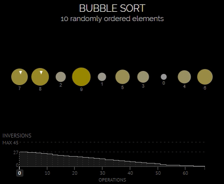

# Пузырьковая сортировка (Bubble sort)

Алгоритм состоит из повторяющихся проходов по сортируемому массиву. 
За каждый проход элементы последовательно сравниваются попарно и, если порядок в паре неверный, выполняется обмен элементов.
Проходы по массиву повторяются N-1 раз или до тех пор, пока на очередном проходе не окажется, что обмены больше не нужны, что означает — массив отсортирован. 
При каждом проходе алгоритма по внутреннему циклу, очередной наибольший элемент массива ставится на своё место в конце массива рядом с предыдущим «наибольшим элементом», а наименьший элемент перемещается на одну позицию к началу массива («всплывает» до нужной позиции, как пузырёк в воде — отсюда и название алгоритма).

## Сложность

| Name                  | Best            | Average             | Worst               | Memory    | Stable    | Comments  |
| --------------------- | :-------------: | :-----------------: | :-----------------: | :-------: | :-------: | :-------- |
| **Bubble sort**       | n               | n<sup>2</sup>       | n<sup>2</sup>       | 1         | Yes       |           |

## Реализация

```go
func BubbleSort(array []int) []int {
	changed := true
	length := len(array)

	// пока есть изменения
	for changed {
		changed = false

		for i := 1; i < length; i++ {
			// если порядок не верный
			if array[i-1] > array[i] {
				// меняем местами элементы
				array[i], array[i-1] = array[i-1], array[i]

				// продолжаем сортировку
				changed = true
			}
		}
	}

	return array
}
```

## Визуализация

